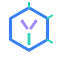
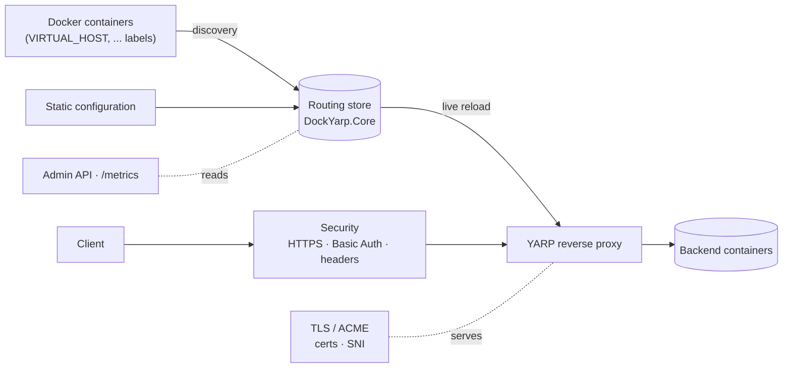

<div align="center">



# DockYarp

**A dynamic reverse proxy for Docker containers, built on YARP and .NET 10.**

Automatic service discovery from container labels, dynamic routing, automatic TLS (ACME),
security middleware, and an admin API — an `nginx-proxy`-style experience, in modern .NET.


</div>

---

## Overview

DockYarp watches your Docker containers and turns their labels into live reverse-proxy configuration —
no restarts, no hand-written routes. Start a container with a `VIRTUAL_HOST` label and it is instantly
routable; request a certificate with `LETSENCRYPT_HOST` and HTTPS is provisioned automatically.

## Features

- 🐳 **Docker auto-discovery** — routes and clusters derived from container labels (nginx-proxy compatible).
- 🔀 **Dynamic routing on YARP** — host/path matching, clusters, load balancing, health checks; reloaded live.
- 🔐 **Automatic TLS (ACME)** — certificate acquisition, renewal, and SNI selection with a self-signed fallback.
- 🛡️ **Security middleware** — per-host HTTPS enforcement, Basic Auth, and hardening headers (HSTS, …).
- 📊 **Admin API & metrics** — read-only `/api/*` endpoints and Prometheus `/metrics`.
- 📦 **Container-native** — minimal, non-root **chiseled** image; reference Docker Compose stack.

## Architecture



Each concern is a focused project; `DockYarp.Core` is a dependency-free leaf that everything else builds on.
See [`docs/`](docs/) for the details of each capability.

## Quick start

Run the reference stack (DockYarp + a labeled sample service):

```bash
docker compose up -d --build
curl -H "Host: whoami.local" http://localhost/    # proxied to the sample service
docker compose down -v
```

Expose your own service by adding labels:

```yaml
services:
  web:
    image: my/web
    labels:
      VIRTUAL_HOST: app.local
      VIRTUAL_PORT: "8080"
      LETSENCRYPT_HOST: app.local
      LETSENCRYPT_EMAIL: admin@example.com
```

DockYarp needs read-only access to the Docker socket (`/var/run/docker.sock`) to discover containers.

## Container labels

| Label | Description |
|---|---|
| `VIRTUAL_HOST` | Host the container is exposed on (**required**). |
| `VIRTUAL_PORT` | Target port (inferred when a single port is exposed). |
| `VIRTUAL_PATH` | Optional path prefix. |
| `LETSENCRYPT_HOST` / `LETSENCRYPT_EMAIL` | Request an ACME certificate for the host. |
| `DOCKYARP_LB` | Load-balancing policy (`round-robin`, `least-requests`). |
| `DOCKYARP_AUTH_USER` / `DOCKYARP_AUTH_PASSWORD` | Basic Auth credentials (planned label wiring). |

Full reference: [`docs/labels-reference.md`](docs/labels-reference.md).

## Admin API & metrics

Protected by an `X-Api-Key` header (`AdminApi:ApiKey`):

| Endpoint | Description |
|---|---|
| `GET /api/routes` | Active routes (sanitized). |
| `GET /api/clusters` | Active clusters and endpoints. |
| `GET /api/certs` | Certificates (populated as TLS matures). |
| `GET /api/health` | Overall status. |
| `GET /metrics` | Prometheus metrics (unauthenticated). |

See [`docs/admin-api.md`](docs/admin-api.md).

## Build & test

The build is driven by [Nuke](https://nuke.build); `build.ps1` / `build.sh` bootstrap it anywhere .NET is installed.

```bash
./build.ps1 Test          # restore, build, and test (Windows)
./build.sh  Test          # Linux/macOS
```

Or directly with the .NET SDK (.NET 10, pinned by `global.json`):

```bash
dotnet build DockYarp.slnx
dotnet test  DockYarp.slnx
```

### Container image & publishing

```bash
./build.ps1 DockerImage                       # build the chiseled image
docker login <registry>                       # authenticate first
./build.ps1 DockerPublish --registry registry.example.com --image-repository team/dockyarp --image-tag 1.2.3
```

See [`docs/deployment.md`](docs/deployment.md).

## Project structure

```
src/
  DockYarp.Core/      # models, interfaces, stores (leaf)
  DockYarp.Docker/    # Docker discovery + label mapping
  DockYarp.Tls/       # ACME + certificates
  DockYarp.Security/  # HTTPS enforcement, auth, headers
  DockYarp.AdminApi/  # admin/observability endpoints
  DockYarp.App/       # ASP.NET host: YARP, DI, pipeline
tests/                   # one *.Tests project per src project (NUnit)
build/                   # Nuke build project
docs/                    # architecture & capability documentation
openspec/                # spec-driven development (specs + changes)
```

## Documentation

| Topic | Document |
|---|---|
| Routing model | [routing-model.md](docs/routing-model.md) |
| Docker discovery | [docker-discovery.md](docs/docker-discovery.md) |
| YARP integration | [yarp-integration.md](docs/yarp-integration.md) |
| Security middleware | [security-middleware.md](docs/security-middleware.md) |
| TLS / ACME | [tls-acme.md](docs/tls-acme.md) |
| Admin API & observability | [admin-api.md](docs/admin-api.md) |
| Deployment | [deployment.md](docs/deployment.md) |

## Development

DockYarp is developed **spec-first** with [OpenSpec](https://github.com/Fission-AI/OpenSpec): every change
starts as a proposal under [`openspec/`](openspec/) and its specs are archived once implemented. Coding
conventions (modern .NET, strict analyzers, Central Package Management) live in [`AGENTS.md`](AGENTS.md),
the source of truth for both humans and AI assistants.

## License

Licensed under the MIT License — see [`LICENSE`](LICENSE).
