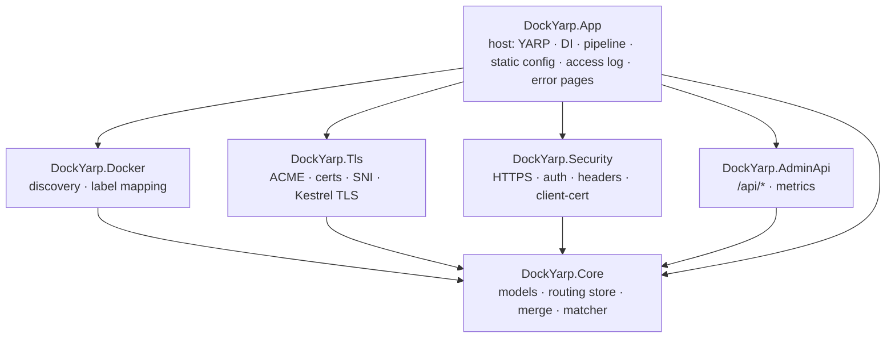
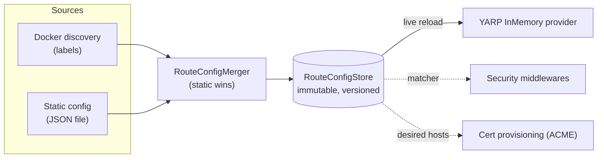

# DockYarp — architecture & nginx-proxy parity

> Built 100% by AI, highly experimental, not for production. See the [README](../README.md) disclaimer.

This document is the single high-level map of DockYarp: how the pieces fit together (architecture), the
request pipeline, and how far it covers nginx-proxy's feature set (parity matrix). For the *why* behind each
capability, see the per-capability docs linked below and the archived proposals under
[`openspec/changes/archive/`](../openspec/changes/archive/).

## What it is

DockYarp is a dynamic reverse proxy for Docker containers — an `nginx-proxy`-style experience built on
**YARP** and **.NET 10**. Container labels (and/or a static file) become live routing configuration; TLS is
provisioned automatically or supplied by the operator; a small security pipeline and an admin/observability
surface sit in front of the proxy. Development is **spec-driven** with OpenSpec.

## Module & capability map

Each concern is a focused project. `DockYarp.Core` is a dependency-free leaf; every module depends on it,
and `DockYarp.App` (the ASP.NET host) composes everything.

| Capability (spec) | Project(s) | Owns |
|---|---|---|
| `proxy-routing` | Core | Route/cluster model, versioned store, matcher, config-source merge (static > dynamic). |
| `docker-discovery` | Docker | Container→config label parsing and mapping; health/network-aware selection. |
| `yarp-dynamic-config` | App | Mapping the store to YARP; live reload; forwarded headers; body-size limit; error pages. |
| `security` | Security | HTTPS method enforcement, Basic Auth, HSTS, client-certificate enforcement, headers. |
| `tls-acme` | Tls | ACME HTTP-01, renewal, provided certs, SNI selection, Kestrel TLS hardening + mTLS. |
| `admin-api` | AdminApi (+ App) | Read-only `/api/*`, Prometheus `/metrics`, structured access logging. |
| `deployment` | build/ + App | Nuke build, chiseled image, compose, HTTPS endpoint, configuration binding. |

## Configuration flow

- **Discovery** (when `Docker:Enabled`) reconciles on startup and on container events (`start/stop/die/update/health_status`), merging the static contribution each pass.
- **Static config** (`StaticConfig:Path`) is applied at startup when discovery is off, or merged by the reconciler when on.
- The **store** publishes an immutable snapshot atomically; readers are lock-free. YARP and the security matcher read from it.

## Request pipeline (in order)

1. **Access log** — structured per-request entry (wraps everything).
2. **Custom error pages** — overlays `{code}.html` on DockYarp-generated error responses.
3. **ACME HTTP-01 challenge** — `/.well-known/acme-challenge/*` over HTTP, before HTTPS enforcement.
4. **Security** — headers/HSTS → HTTPS redirection (method + cert availability; `nohttps` refusal) → client-certificate → Basic Auth.
5. **Request body-size limit** — per-route max body size.
6. **Endpoints** — `/api/*` (admin), `/metrics`, then YARP `MapReverseProxy` (catch-all), then the default-response fallback.

TLS runs at the Kestrel layer: the SNI selector picks the certificate per host (exact → wildcard parent →
self-signed fallback); min TLS version, protocols, ciphers, and client-certificate validation are configured
on the HTTPS defaults.

## nginx-proxy parity matrix

Legend: ✅ implemented · ⚠️ partial / config-only (runtime-unvalidated) · ⛔ deferred / not implemented.

### Routing
| Feature | Status | Notes |
|---|---|---|
| Host/path routing, clusters, load balancing | ✅ | Round-robin / least-requests. |
| Replica aggregation | ✅ | One endpoint per container per cluster. |
| Multiple hosts per container (`VIRTUAL_HOST=a,b`) | ✅ | Comma-separated. |
| Wildcard host | ⚠️ | Single-level `*.suffix`; multi-level/regex ⛔. |
| `VIRTUAL_HOST_MULTIPORTS` | ✅ | YAML host→path→{port,proto,dest}. |
| `VIRTUAL_DEST` path rewrite | ⚠️ | Prefix-strip only; arbitrary rewrites ⛔. |
| `DEFAULT_HOST` / catch-all + default response | ✅ | Default status configurable. |
| Priority (`DOCKYARP_PRIORITY`) | ✅ | Maps to YARP order. |

### Protocols
| Feature | Status | Notes |
|---|---|---|
| `VIRTUAL_PROTO` http/https | ✅ | grpc/fastcgi/uwsgi ⛔. |
| WebSocket | ✅ | YARP default. |
| HTTP/2 | ✅ | Configurable protocols. |
| HTTP/3 | ⚠️ | Config toggle; needs MsQuic (runtime). |

### TLS
| Feature | Status | Notes |
|---|---|---|
| ACME HTTP-01, renewal, SNI, self-signed fallback | ✅ | HTTPS endpoint on 8443. |
| Provided certs (PEM/PFX), wildcard-parent selection | ✅ | Mounted into the certs dir. |
| `HTTPS_METHOD` (redirect/noredirect/nohttp/nohttps) | ✅ | Redirect gated on real cert availability. |
| Min TLS version / ciphers / protocols | ⚠️ | Wired as config; ciphers Linux/macOS only. |
| HSTS (preload + per-host `HSTS`) | ✅ | |
| Mutual TLS (`DOCKYARP_CLIENT_CERT` + CA) | ⚠️ | CA validation + per-host enforcement; handshake runtime-unvalidated. |
| `CERT_NAME` shared cert, DNS-01, OCSP stapling | ⛔ | Deferred. |

### Headers & proxying
| Feature | Status | Notes |
|---|---|---|
| `X-Forwarded-*`, `X-Real-IP`, Host, downstream-proxy trust | ✅ | |
| `client_max_body_size` (`DOCKYARP_MAX_BODY_SIZE`) | ✅ | Per-route. |
| Proxy timeouts (`DOCKYARP_PROXY_TIMEOUT`) | ✅ | Per-cluster activity timeout. |
| Response buffering, gzip, httpoxy mitigation | ⛔ | YARP streams by default; rest deferred. |

### Discovery & network
| Feature | Status | Notes |
|---|---|---|
| Network selection (preferred network, skip `ingress`) | ✅ | Deterministic. |
| Health-aware (exclude unhealthy/starting) | ✅ | Reacts to `health_status` events. |
| `NETWORK_ACCESS=internal`, host-mode, prefer-IPv6 | ⛔ | Deferred. |

### Extensibility & ops
| Feature | Status | Notes |
|---|---|---|
| Static configuration source (file) | ✅ | JSON (our variant), merged with precedence. |
| Custom error pages | ✅ | DockYarp-generated errors only (no backend buffering). |
| Basic Auth (`DOCKYARP_AUTH_*`) | ✅ | Label-based; htpasswd files ⛔. |
| Access logging | ✅ | Structured; JSON via the logging provider. |
| Per-vhost config overrides (`vhost.d`) | ⛔ | Deferred. |
| PROXY protocol, Docker Swarm, IPv6 listeners | ⛔ | Runtime-heavy; deferred to a runtime-capable session. |

## Not yet real end to end

Several features are unit/integration-tested but not validated against a running proxy on this machine (no
local Docker): the SNI handshake, mutual-TLS handshake, cipher/HTTP-3 wiring, and multi-port/provided-cert
proxying. A planned **Aspire-based end-to-end suite** will exercise these in real conditions.

## Where to go next

Per-capability detail: [routing-model](routing-model.md) · [docker-discovery](docker-discovery.md) ·
[yarp-integration](yarp-integration.md) · [security-middleware](security-middleware.md) ·
[tls-acme](tls-acme.md) · [admin-api](admin-api.md) · [deployment](deployment.md) ·
[labels-reference](labels-reference.md). Conventions: [AGENTS.md](../AGENTS.md).
