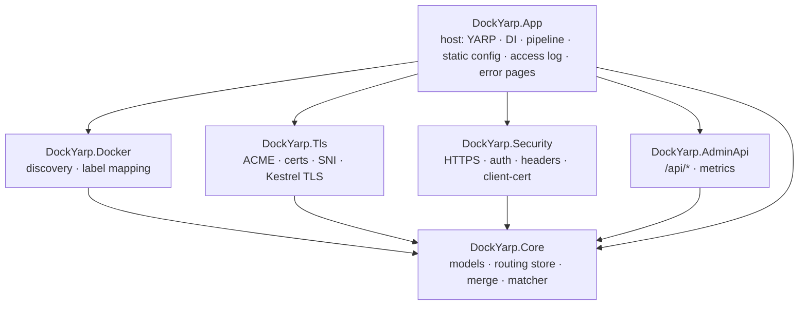
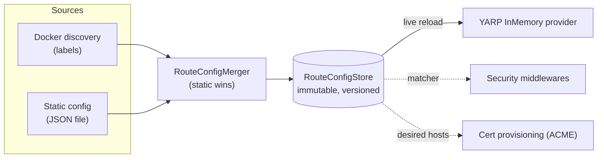

# DockYarp — architecture & nginx-proxy parity

> Built 100% by AI, highly experimental, not for production. See the [README](../README.md) disclaimer.

This document is the single high-level map of DockYarp: how the pieces fit together (architecture), the
request pipeline, and how far it covers nginx-proxy's feature set (parity matrix). For the *why* behind each
capability, see the per-capability docs linked below and the archived proposals under
[`openspec/changes/archive/`](../openspec/changes/archive/).

## What it is

DockYarp is a dynamic reverse proxy for Docker containers — an `nginx-proxy`-style experience built on
**YARP** and **.NET 10**. Container labels (and/or a static file) become live routing configuration; TLS is
provisioned automatically or supplied by the operator; a small security pipeline and an admin/observability
surface sit in front of the proxy. Development is **spec-driven** with OpenSpec.

## Module & capability map

Each concern is a focused project. `DockYarp.Core` is a dependency-free leaf; every module depends on it,
and `DockYarp.App` (the ASP.NET host) composes everything.

| Capability (spec) | Project(s) | Owns |
|---|---|---|
| `proxy-routing` | Core | Route/cluster model, versioned store, matcher, config-source merge (static > dynamic). |
| `docker-discovery` | Docker | Container→config label parsing and mapping; health/network-aware selection. |
| `yarp-dynamic-config` | App | Mapping the store to YARP; live reload; forwarded headers; body-size limit; error pages. |
| `security` | Security | HTTPS method enforcement, Basic Auth, HSTS, client-certificate enforcement, headers. |
| `tls-acme` | Tls | ACME HTTP-01, renewal, provided certs, SNI selection, Kestrel TLS hardening + mTLS. |
| `admin-api` | AdminApi (+ App) | Read-only `/api/*`, Prometheus `/metrics`, structured access logging. |
| `deployment` | build/ + App | Fallout build, chiseled image, compose, HTTPS endpoint, configuration binding. |

## Configuration flow

- **Discovery** (when `Docker:Enabled`) reconciles on startup and on container events (`start/stop/die/update/health_status`), merging the static contribution each pass.
- **Static config** (`StaticConfig:Path`) is applied at startup when discovery is off, or merged by the reconciler when on.
- The **store** publishes an immutable snapshot atomically; readers are lock-free. YARP and the security matcher read from it.

## Request pipeline (in order)

1. **Access log** — structured per-request entry (wraps everything).
2. **Custom error pages** — overlays `{code}.html` on DockYarp-generated error responses.
3. **ACME HTTP-01 challenge** — `/.well-known/acme-challenge/*` over HTTP, before HTTPS enforcement.
4. **Security** — headers/HSTS → HTTPS redirection (method + cert availability; `nohttps` refusal) → client-certificate → Basic Auth.
5. **Request body-size limit** — per-route max body size.
6. **Endpoints** — `/api/*` (admin), `/metrics`, then YARP `MapReverseProxy` (catch-all), then the default-response fallback.

TLS runs at the Kestrel layer: the SNI selector picks the certificate per host (exact → wildcard parent →
self-signed fallback); min TLS version, protocols, ciphers, and client-certificate validation are configured
on the HTTPS defaults.

## nginx-proxy parity

DockYarp implements the core of nginx-proxy — host/path routing, clusters and load balancing, multi-host,
`VIRTUAL_HOST_MULTIPORTS`, `VIRTUAL_PROTO` (http/https), `DEFAULT_HOST`, ACME HTTP-01 + provided certs + SNI +
HSTS + mutual TLS, forwarded headers, per-route body-size and per-cluster timeout, Basic Auth, access logging,
an admin API, and a container-native image — plus the `DOCKYARP_PRIORITY` extension.

The **full, authoritative parity matrix** (implemented / partial / deferred, with a backlog item per gap) is
the single source of truth and lives in **[`openspec/backlog/parity.md`](../openspec/backlog/parity.md)**.
Known gaps — multi-level/regex hosts, arbitrary `VIRTUAL_DEST` rewrite, `CERT_NAME`/DNS-01/OCSP, gzip, PROXY
protocol, `NETWORK_ACCESS=internal`, htpasswd files, `vhost.d` overrides, IPv6, Docker Swarm, … — are each
tracked as a promotable stub under [`openspec/backlog/items/`](../openspec/backlog/items/), and architectural
non-goals (fastcgi/uwsgi, L4 stream, split docker-gen mode) are documented there too. See
[`openspec/backlog/README.md`](../openspec/backlog/README.md) for the change lifecycle.

## End to end

An **Aspire-based end-to-end suite** (`tests/DockYarp.E2E.*`) boots DockYarp as a container in front of
labeled backend containers on a real Docker daemon and asserts the HTTP behaviour — discovery, multi-host,
path rewrite, multi-port, default host, Basic Auth, proxy tuning, health-aware exclusion, forwarded
headers, and the admin API. It runs via `./build.ps1 E2E` (and as part of `./build.ps1 Release`), and is
excluded from the default build/test so the developer loop needs no Docker. See [deployment](deployment.md).

The suite also covers **TLS**: a `smallstep/step-ca` ACME server issues real certificates over HTTP-01, and
scenarios assert ACME provisioning, the self-signed fallback, HTTP→HTTPS redirect, per-host HSTS, and mutual
TLS. These are authored and run under `E2E`, pending validation in a Docker-capable session (the CA-trust
bridge, HTTP-01 host aliasing, and mutual-TLS client-cert wiring are the parts to confirm at runtime).
Cipher-suite and HTTP-3 wiring remain unit/integration-tested only.

## Where to go next

Per-capability detail: [routing-model](routing-model.md) · [docker-discovery](docker-discovery.md) ·
[yarp-integration](yarp-integration.md) · [security-middleware](security-middleware.md) ·
[tls-acme](tls-acme.md) · [admin-api](admin-api.md) · [deployment](deployment.md) ·
[labels-reference](labels-reference.md). Conventions: [AGENTS.md](../AGENTS.md).
